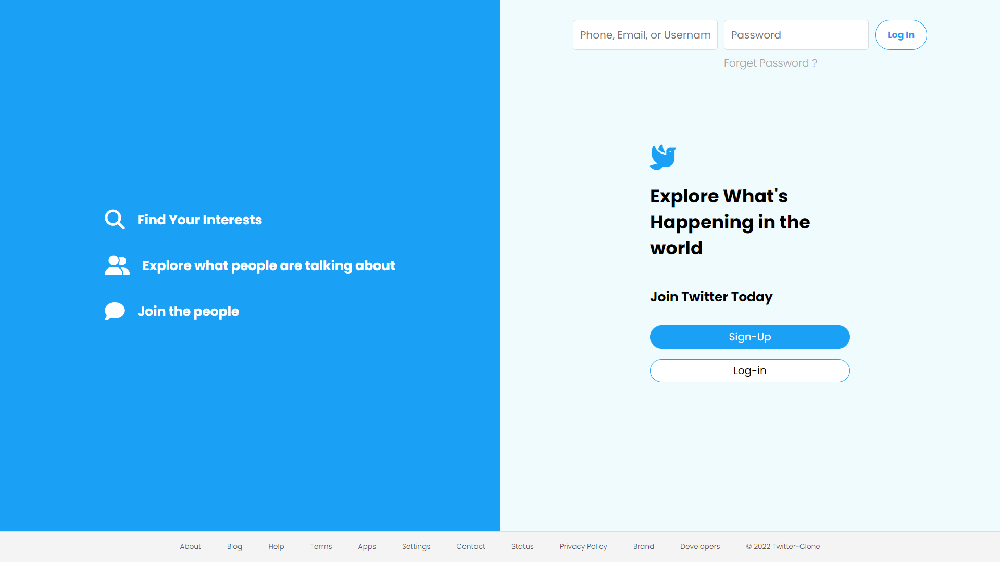
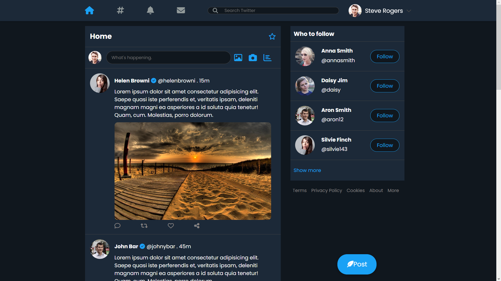

# TWITTER-CLONE
This is a basic responsive [Twitter](https://indrarjun.github.io/TWITTER-CLONE/) clone using

It has a landing page, home page with dark theme and also a tweet pop-up option.

****
## Landing Page

 ****
 ## Dark Mode
 
 

 

  

